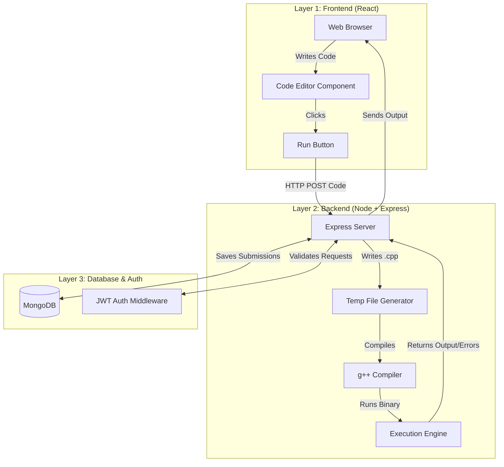

<div align="center">
  
  
  # 🚀 AlgoRun
  
  **A High-Performance, Sandboxed Remote Code Execution Platform**
  
  [](https://reactjs.org/)
  [](https://nodejs.org/)
  [](https://expressjs.com/)
  [](https://www.mongodb.com/)

  <p align="center">
    AlgoRun brings the LeetCode experience to your browser. Write C++ code, hit run, and see your output instantly—powered by a secure, concurrent, and asynchronous backend.
  </p>
</div>

<br/>

## ✨ Key Features

- **🛡️ Sandboxed Execution:** User-submitted code runs securely on the server with strict timeout (TLE) mechanisms to prevent infinite loops and server crashes.
- **⚡ Async Pipeline:** Non-blocking compilation and execution architecture.
- **🔒 JWT Authentication:** Secure, stateless authentication with protected API routes.
- **🔀 Concurrent Processing:** Isolated temporary file handling ensures that multiple users can compile and execute code simultaneously without race conditions or overwriting.

---

## 🏗️ System Architecture

AlgoRun is built on a robust three-tier architecture ensuring perfect separation of concerns:



---

## 💻 Tech Stack

### Frontend
* **React** - Component-based UI rendering
* **Axios** - HTTP client for API requests
* **react-simple-code-editor** - Lightweight, native code editing experience

### Backend
* **Node.js + Express** - High-performance asynchronous API server
* **Mongoose** - Elegant MongoDB object modeling
* **child_process** - Core module used for spawning `g++` compilation and execution tasks

### Infrastructure & Security
* **MongoDB Atlas** - Cloud database hosting
* **JWT (JSON Web Tokens)** - Securing protected routes and sessions
* **Bcrypt.js** - Secure password hashing

---

## 📂 Project Structure

```text
AlgoRun/
├── backend/                  # Layer 2 & 3
│   ├── src/
│   │   ├── controllers/      # API logic (auth, run, history)
│   │   ├── middlewares/      # JWT protection
│   │   ├── models/           # Mongoose schemas
│   │   ├── routes/           # Endpoint mapping
│   │   └── utils/            # Execution & Temp file helpers
│   └── temp/                 # Sandboxed environment for C++ builds
└── frontend/                 # Layer 1
    └── src/
        ├── components/       # Editor, Navbar, Output blocks
        ├── pages/            # Home, Login, Register, History
        └── services/         # Axios API configuration
```

---

## 🚀 Getting Started

### 1. Clone the Repository
```bash
git clone https://github.com/2006biswa/Algo-Run.git
cd Algo-Run
```

### 2. Setup the Backend
```bash
cd backend
npm install
# Add your .env file with MONGO_URI and JWT_SECRET
npm run dev
```

### 3. Setup the Frontend
```bash
cd ../frontend
npm install
npm start
```

<br/>

<div align="center">
  <i>Built with passion as part of a 7-Day Full-Stack Mastery Plan.</i>
</div>
